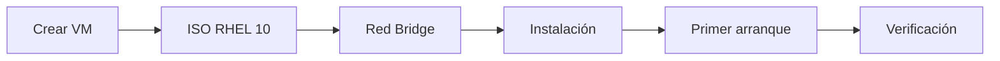

# 01 · Fundamentos de RHEL 10

> Instalación · Networking · Usuarios y grupos · Permisos

[⬅️ Volver al índice](../README.md)

## 🎬 Playlist

> 🔴 **YouTube:** `https://www.youtube.com/playlist?list=PLQ9VDfI34EckrjTbpl6UQh6QGQlRjJ9MQ`

---

## 🎯 Objetivo

Construir una instalación funcional de RHEL y dominar las cuatro operaciones base sobre las que se apoyan los laboratorios posteriores: **instalación, red, identidad y permisos**.

## 🗺️ Prácticas

| Práctica | Tema | Entrega |
|---|---|---|
| 01 | Instalación del sistema | VM arrancando RHEL |
| 02 | Red + DNS | DHCP / estática / DNS operativo |
| 03 | Usuarios y grupos | `wheel`, `guest`, altas y bajas |
| 04 | Permisos | `chmod`, propietario y grupo |

---

# 🧪 Práctica 01 — Instalación del sistema operativo

### 🎥 Video / Playlist
`PENDIENTE`

### Requisitos

- Hipervisor compatible.
- ISO de RHEL 10.
- VM con CPU, RAM y almacenamiento adecuados para tu entorno.
- Adaptador de red en **Bridge** para las pruebas de red del curso.

### Flujo



### Procedimiento

1. Crea una VM e identifica claramente su nombre, CPU, memoria y disco.
2. Monta la ISO de RHEL 10.
3. Configura el adaptador virtual en modo **Bridge** si la práctica necesita que la VM sea un host más de la red física.
4. Inicia el instalador.
5. Define zona horaria, idioma, almacenamiento, usuario administrativo y red.
6. Finaliza la instalación y reinicia.

### ✅ Verificación

```bash
cat /etc/redhat-release
uname -r
hostnamectl
ip address
ip route
```

**Resultado esperado:** el sistema identifica RHEL 10, tiene hostname configurado, una interfaz activa y una ruta de salida válida.

### 📸 Evidencia

- Pantalla final del instalador.
- Primer arranque.
- `cat /etc/redhat-release`.
- `ip address` y `ip route`.

---

# 🧪 Práctica 02 — Parámetros de red y DNS

### 🎥 Video / Playlist
`PENDIENTE`

RHEL 10 utiliza **NetworkManager**. Red Hat documenta varias rutas para configurar Ethernet: `nmcli`, `nmtui`, la GUI de GNOME, `nmstatectl` y RHEL System Roles. citeturn551718search5

## A. Identificar interfaz y conexión

```bash
ip link
nmcli device status
nmcli connection show
```

## B. DHCP con `nmcli`

```bash
nmcli connection show
sudo nmcli connection modify "<CONEXION>" ipv4.method auto
sudo nmcli connection up "<CONEXION>"
ip address show
```

## C. IP estática con `nmcli`

Ejemplo con datos de laboratorio:

```bash
sudo nmcli connection modify "<CONEXION>" \
  ipv4.method manual \
  ipv4.addresses "192.168.1.50/24" \
  ipv4.gateway "192.168.1.1" \
  ipv4.dns "8.8.8.8 8.8.4.4"

sudo nmcli connection up "<CONEXION>"
```

Verifica:

```bash
ip address
ip route
resolvectl status 2>/dev/null || nmcli dev show
```

## D. Configuración con `nmtui`

```bash
sudo nmtui
```

En **Edit a connection** puedes definir DHCP o datos manuales y DNS.

## E. Configuración gráfica

En un escritorio GNOME, la configuración de red puede hacerse desde **Settings → Network**. RHEL documenta esta ruta como otra alternativa válida. citeturn551718search5

## F. `nmstatectl`

Para entornos declarativos puede utilizarse Nmstate. Un ejemplo conceptual:

```yaml
interfaces:
  - name: <INTERFAZ>
    type: ethernet
    state: up
    ipv4:
      enabled: true
      dhcp: false
      address:
        - ip: 192.168.1.50
          prefix-length: 24
      dhcp: false
routes:
  config:
    - destination: 0.0.0.0/0
      next-hop-address: 192.168.1.1
      next-hop-interface: <INTERFAZ>
dns-resolver:
  config:
    server:
      - 8.8.8.8
      - 8.8.4.4
```

> [!NOTE]
> El YAML anterior es una plantilla conceptual: adapta nombres de interfaz, gateway y sintaxis exacta al estado de tu entorno antes de aplicarlo.

### ✅ Verificación final

```bash
nmcli general status
nmcli device show <INTERFAZ>
ping -c 4 8.8.8.8
getent hosts example.com
```

### 📸 Evidencia

- DHCP activo.
- IP estática activa.
- `nmcli connection show`.
- DNS 8.8.8.8 / 8.8.4.4.
- Resolución de un nombre.

---

# 🧪 Práctica 03 — Usuarios y grupos

### 🎥 Video / Playlist
`PENDIENTE`

## A. Crear usuario administrativo

```bash
sudo useradd <USUARIO>
sudo passwd <USUARIO>
sudo usermod -aG wheel <USUARIO>
```

Verifica:

```bash
id <USUARIO>
getent group wheel
sudo -l -U <USUARIO>
```

## B. Crear grupo `guest` y usuario

```bash
sudo groupadd guest
sudo useradd <GUEST_USER>
sudo passwd <GUEST_USER>
sudo usermod -aG guest <GUEST_USER>
```

Verifica:

```bash
id <GUEST_USER>
getent group guest
```

## C. Eliminación

> [!WARNING]
> La eliminación debe hacerse solo sobre las cuentas creadas para el laboratorio.

```bash
sudo userdel <GUEST_USER>
sudo groupdel guest
```

### ✅ Verificación

```bash
getent passwd <GUEST_USER> || echo "Usuario eliminado"
getent group guest || echo "Grupo eliminado"
```

---

# 🧪 Práctica 04 — Permisos de archivos

### 🎥 Video / Playlist
`PENDIENTE`

## A. Crear estructura

```bash
mkdir -p ~/materia
cd ~/materia
touch estudiante.txt
vi estudiante.txt
```

Dentro del archivo:

```text
Nombre: <TU_NOMBRE>
Matrícula: <TU_MATRICULA>
```

## B. Inspección

```bash
ls -l estudiante.txt
stat estudiante.txt
```

## C. Propietario con control total

El propietario debe tener `rwx`, mientras grupo y otros quedan sin acceso:

```bash
chmod 700 estudiante.txt
```

> Para cumplir estrictamente con “archivo bajo control total del propietario”, `700` es una configuración clara: `rwx------`.

## D. Grupo con control total

Primero cambia el grupo propietario:

```bash
sudo chgrp <GRUPO> estudiante.txt
chmod 070 estudiante.txt
```

En un escenario completo de administración suele ser más útil conservar lectura para otros actores autorizados. Para el objetivo literal del laboratorio, valida que el grupo tenga `rwx` y documenta el estado resultante con `ls -l`.

## E. Copia a `materia2`

```bash
mkdir -p ~/materia2
cp ~/materia/estudiante.txt ~/materia2/
ls -l ~/materia2/estudiante.txt
```

## F. Eliminar `materia`

```bash
rm -rf ~/materia
```

### ✅ Verificación final

```bash
test ! -d ~/materia && echo "materia eliminada"
test -f ~/materia2/estudiante.txt && echo "copia disponible"
```

### 📸 Evidencia

- `ls -l` antes y después de `chmod`.
- `stat` del archivo.
- Copia en `materia2`.
- Eliminación de `materia`.

---

## ✅ Checklist del módulo

- [ ] RHEL 10 instalado.
- [ ] Red Bridge validada.
- [ ] DHCP configurado.
- [ ] IP estática configurada.
- [ ] DNS configurado.
- [ ] Usuario en `wheel`.
- [ ] Grupo `guest` creado y eliminado.
- [ ] Permisos probados.
- [ ] Evidencias capturadas.
- [ ] Playlist enlazada.
