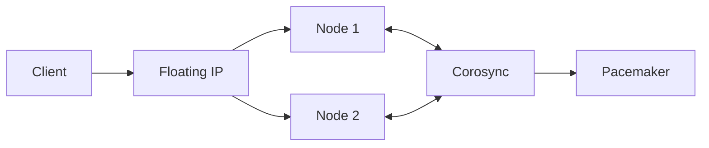
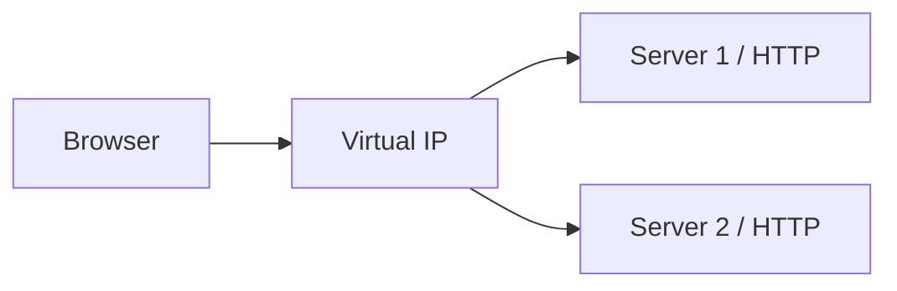

# 05 · Alta disponibilidad

> Rsync · Pacemaker + Corosync · Keepalived

[⬅️ Volver al índice](../README.md)

## 🎬 Playlists https://www.youtube.com/playlist?list=PLFrQuLFGh3i0


> [!IMPORTANT]
> Para un cluster de dos nodos en RHEL 10, Red Hat documenta Pacemaker como gestor de recursos y Corosync para comunicación/membresía. La herramienta CLI de configuración es `pcs`. También se contempla fencing como parte de una implementación real de HA. citeturn447372search0turn447372search4

---

# 🧪 Práctica 01 — Rsync + sincronización por cron

## 1. Crear 100 archivos en el servidor primario

```bash
mkdir -p ~/rsync-lab
cd ~/rsync-lab
for i in $(seq 1 100); do touch "archivo_$i.txt"; done
ls | wc -l
```

## 2. Copiar al servidor secundario

```bash
rsync -av ~/rsync-lab/ <USUARIO>@<IP_SECUNDARIO>:~/rsync-lab/
```

## 3. Crear script de sincronización

`~/bin/sync-rsync.sh`:

```bash
#!/usr/bin/env bash
set -euo pipefail
rsync -az --delete "$HOME/rsync-lab/" "<USUARIO>@<IP_SECUNDARIO>:$HOME/rsync-lab/"
```

```bash
chmod +x ~/bin/sync-rsync.sh
```

Configura autenticación SSH por llave entre los hosts para evitar prompts interactivos.

## 4. Cron cada minuto

```bash
crontab -e
```

```cron
* * * * * /home/<USUARIO>/bin/sync-rsync.sh >> /home/<USUARIO>/rsync.log 2>&1
```

## 5. Validación

```bash
echo "nuevo archivo" > ~/rsync-lab/prueba.txt
```

Después de la ejecución:

```bash
ssh <USUARIO>@<IP_SECUNDARIO> 'ls -l ~/rsync-lab/prueba.txt'
```

---

# 🧪 Práctica 02 — Cluster Pacemaker + Corosync

## Arquitectura



## Requisitos

- 2 nodos RHEL.
- Hostnames resolubles entre sí.
- Red estable.
- Repositorio High Availability habilitado según la suscripción/arquitectura.
- Fencing apropiado para una implementación real.

Red Hat indica que un cluster de alta disponibilidad de dos nodos debe contemplar red para la comunicación y un dispositivo de fencing para cada nodo. citeturn447372search4

## Instalar software

En ambos nodos, habilita el repositorio HA correspondiente y sigue la documentación oficial de RHEL 10 para instalar `pcs`, `pacemaker` y `corosync`. citeturn447372search4

## Identidad y autenticación

```bash
hostnamectl
getent hosts <NODE1>
getent hosts <NODE2>
```

Luego configura la administración del cluster con `pcs`.

### Construcción conceptual

```text
pcs host auth node1 node2
pcs cluster setup <NOMBRE_CLUSTER> node1 node2
pcs cluster start --all
pcs cluster enable --all
```

> [!NOTE]
> Los nombres exactos, el método de autenticación y la configuración de fencing dependen de la topología. La práctica no debe considerarse “production-ready” hasta documentar STONITH/fencing y quorum.

## IP flotante

Crea un recurso de IP virtual con la dirección elegida en la red de laboratorio y valida:

```bash
pcs status
ip address
ping -c 4 <IP_FLOTANTE>
```

## Prueba de failover

1. Haz ping continuo a la IP flotante.
2. Coloca el servicio/nodo activo fuera de línea de manera controlada.
3. Observa `pcs status`.
4. Comprueba que la IP virtual reaparece en el nodo superviviente.
5. Repite alternando nodos.

### ✅ Evidencia

- `pcs status`.
- IP flotante en Node 1.
- Failover.
- IP flotante en Node 2.
- Ping que se recupera tras el cambio.

---

# 🧪 Práctica 03 — HA HTTP con Keepalived

## Topología



## 1. Preparar los dos servidores web

Instala `httpd` o NGINX en ambos y crea una página que identifique al nodo:

```html
<h1>SERVER 1</h1>
```

y en el segundo:

```html
<h1>SERVER 2</h1>
```

## 2. Keepalived

Instala el paquete y configura un estado MASTER/BACKUP con una VIP de laboratorio.

```bash
sudo dnf install -y keepalived
sudo systemctl enable --now keepalived
```

Configura en `/etc/keepalived/keepalived.conf` los parámetros de tu interfaz, router ID, prioridades y VIP.

### ✅ Validación

```bash
systemctl status keepalived
ip address
curl http://<VIP>
```

Apaga uno de los nodos y comprueba que la VIP y el servicio continúan atendiendo desde el otro.

> [!CAUTION]
> Keepalived ofrece alta disponibilidad de dirección/servicio, pero no sustituye por sí solo una arquitectura de aplicación completa. Documenta qué componente está protegiendo.

---

## ✅ Checklist

- [ ] Rsync inicial.
- [ ] Script de sincronización.
- [ ] Cron de 1 minuto.
- [ ] Cluster de dos nodos.
- [ ] Pacemaker/Corosync.
- [ ] VIP.
- [ ] Failover probado.
- [ ] Keepalived.
- [ ] HTTP continúa tras apagar un nodo.
