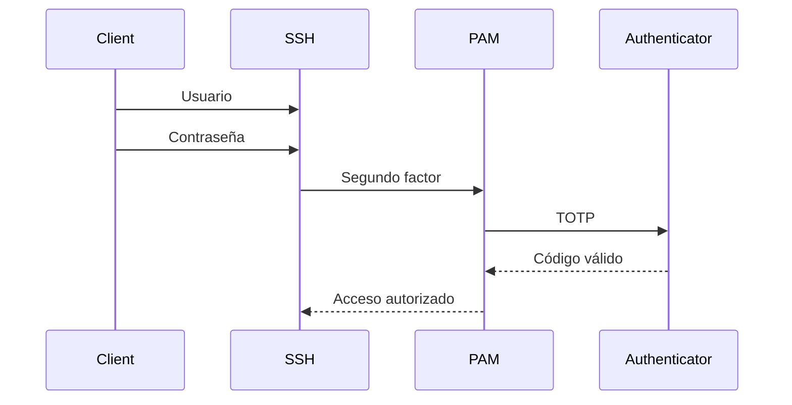

# 06 · Seguridad

> GPG · Firewalls · IDS · 2FA para SSH

[⬅️ Volver al índice](../README.md)

## 🎬 Playlists

- Práctica 01: `PENDIENTE`
- Práctica 02: `PENDIENTE`
- Práctica 03: `PENDIENTE`
- Práctica 04: `PENDIENTE`

---

# 🧪 Práctica 01 — Cifrado con GPG

## 1. Instalar

```bash
sudo dnf install -y gnupg2
```

## 2. Crear laboratorio

```bash
mkdir -p ~/gpg-lab
cd ~/gpg-lab
echo "Archivo confidencial de laboratorio" > secreto.txt
```

## 3. Cifrar con clave simétrica

```bash
gpg --symmetric secreto.txt
```

Se generará un archivo cifrado `secreto.txt.gpg`.

## 4. Intentar acceder

```bash
file secreto.txt.gpg
cat secreto.txt.gpg
```

El contenido no debe ser legible como texto plano.

## 5. Descifrar

```bash
gpg --output secreto-recuperado.txt --decrypt secreto.txt.gpg
cat secreto-recuperado.txt
```

### ✅ Evidencia

- Archivo original.
- Archivo `.gpg`.
- Descifrado exitoso.
- No publicar la contraseña utilizada.

---

# 🧪 Práctica 02 — Firewall-cmd / nftables

RHEL 10 documenta `firewalld` y `nftables` como mecanismos principales de filtrado. `firewalld` trabaja con zonas, servicios y configuraciones runtime/permanentes. citeturn447372search2turn447372search3

## 1. Servicios de prueba

Instala y habilita solo los servicios que realmente utilices para la práctica. Por ejemplo:

```bash
sudo dnf install -y httpd vsftpd openssh-server
sudo systemctl enable --now httpd vsftpd sshd
```

## 2. Abrir servicios con firewalld

```bash
sudo firewall-cmd --get-active-zones
sudo firewall-cmd --permanent --add-service=http
sudo firewall-cmd --permanent --add-service=ftp
sudo firewall-cmd --permanent --add-service=ssh
sudo firewall-cmd --reload
```

Verifica:

```bash
sudo firewall-cmd --list-all
```

## 3. Bloquear puertos

Para demostrar el concepto con puertos explícitos:

```bash
sudo firewall-cmd --permanent --remove-service=http
sudo firewall-cmd --permanent --remove-service=ftp
sudo firewall-cmd --permanent --remove-service=ssh
sudo firewall-cmd --reload
```

Luego valida la conectividad desde el cliente.

## 4. Volver a habilitar

```bash
sudo firewall-cmd --permanent --add-service=http
sudo firewall-cmd --permanent --add-service=ftp
sudo firewall-cmd --permanent --add-service=ssh
sudo firewall-cmd --reload
```

### Sobre `iptables`

El enunciado solicita `iptables`; RHEL 10 debe documentarse desde la pila moderna de filtrado de Red Hat. Para este repo, la práctica se centra en `firewalld` y, cuando se necesite control de bajo nivel, `nftables`. citeturn447372search2

---

# 🧪 Práctica 03 — IDS Snort

## Objetivo

Instalar Snort y detectar tráfico ICMP y conexiones hacia 21/tcp, 22/tcp y 80/tcp.

## Diseño de reglas

Conceptualmente, las reglas deben detectar:

```text
ICMP → host protegido
TCP/21 → host protegido
TCP/22 → host protegido
TCP/80 → host protegido
```

Una forma didáctica de documentarlas es mantenerlas en un archivo propio de reglas del laboratorio y explicar qué significa cada campo de la regla antes de activarla.

> [!NOTE]
> La instalación exacta de Snort en RHEL 10 depende de la versión de Snort y del método de distribución utilizado. En este repositorio se recomienda fijar explícitamente la versión, registrar la fuente del paquete y no publicar binarios no redistribuibles.

## Pruebas

Desde el host cliente:

```bash
ping <IP_SERVIDOR>
ssh <USUARIO>@<IP_SERVIDOR>
curl http://<IP_SERVIDOR>
```

Prueba TCP/21 con el cliente apropiado si tienes el servicio FTP levantado.

### Evidencia

- Regla cargada.
- Snort ejecutándose.
- Tráfico generado desde el cliente.
- Alertas correspondientes.

---

# 🧪 Práctica 04 — 2FA con Google Authenticator + PAM

## Objetivo

Hacer que SSH solicite dos factores: **contraseña + código temporal**.

## Flujo



## Pasos de alto nivel

1. Instala el módulo PAM/TOTP apropiado para tu RHEL 10.
2. Configura el secreto TOTP para el usuario del laboratorio.
3. Ajusta `/etc/pam.d/sshd` para incluir el módulo de autenticación de un solo uso.
4. Configura `sshd_config` para solicitar el segundo factor.
5. Valida sintaxis y reinicia `sshd`.
6. Prueba desde el host cliente.

Antes de cerrar tu sesión actual, conserva una segunda sesión administrativa abierta para poder revertir la configuración si cometes un error.

### ✅ Resultado esperado

El flujo solicita:

```text
Password:
Verification code:
```

y solo permite el acceso cuando ambos factores son correctos.

> [!WARNING]
> Nunca publiques en GitHub el secreto TOTP, códigos, recovery codes ni capturas donde aparezcan.

---

## ✅ Checklist

- [ ] GPG cifrado/descifrado.
- [ ] Firewall probado en bloqueo y apertura.
- [ ] Snort detectando tráfico.
- [ ] PAM configurado.
- [ ] SSH solicitando segundo factor.
- [ ] Secretos excluidos del repositorio.
