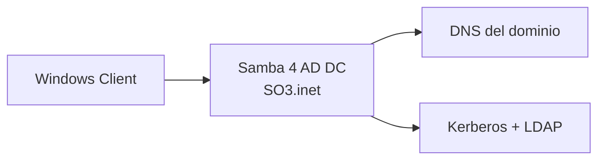

# 07 · Compartición de archivos y dominio

> NFS · Samba · Samba 4 AD DC

[⬅️ Volver al índice](../README.md)

## 🎬 Playlists

- Práctica 01: `PENDIENTE`
- Práctica 02: `PENDIENTE`
- Práctica 03: `PENDIENTE`

---

# 🧪 Práctica 01 — NFS

## Objetivo

Compartir un directorio desde RHEL hacia otro cliente Linux, montarlo manualmente y dejarlo persistente mediante `/etc/fstab`.

### 1. Crear 100 archivos

```bash
sudo mkdir -p /srv/OS3
sudo touch /srv/OS3/Adrian{1..100}.txt
ls /srv/OS3 | wc -l
```

### 2. Permisos

Define el propietario/grupo y permisos mínimos necesarios para el escenario del laboratorio.

```bash
sudo chown -R root:root /srv/OS3
sudo chmod 755 /srv/OS3
```

### 3. Exportar

Edita `/etc/exports`:

```text
/srv/OS3 <RED_CLIENTE>(rw,sync)
```

Exporta:

```bash
sudo exportfs -rav
sudo exportfs -v
```

### 4. Cliente NFS

En el cliente Linux:

```bash
sudo dnf install -y nfs-utils
sudo mkdir -p /mnt/os3
sudo mount <IP_SERVIDOR>:/srv/OS3 /mnt/os3
ls /mnt/os3 | head
```

### 5. Persistencia

Obtén la información del montaje:

```bash
findmnt /mnt/os3
```

Añade a `/etc/fstab`:

```text
<IP_SERVIDOR>:/srv/OS3 /mnt/os3 nfs defaults,_netdev 0 0
```

Prueba:

```bash
sudo umount /mnt/os3
sudo mount -a
ls /mnt/os3 | wc -l
```

### ✅ Evidencia

- 100 archivos en servidor.
- `exportfs -v`.
- Directorio montado en cliente.
- Reinicio del cliente.
- Montaje automático después del reinicio.

---

# 🧪 Práctica 02 — Samba + Windows

## 1. Instalar

```bash
sudo dnf install -y samba samba-client policycoreutils-python-utils
sudo systemctl enable --now smb nmb
```

> Los nombres de servicios y paquetes pueden variar según el perfil de instalación y stream disponible; documenta el estado de tu sistema.

## 2. Crear recurso

```bash
sudo mkdir -p /srv/samba/OS3
sudo touch /srv/samba/OS3/adrian{1..100}.txt
```

## 3. Usuario Samba

```bash
sudo useradd <USUARIO_SAMBA>
sudo passwd <USUARIO_SAMBA>
sudo smbpasswd -a <USUARIO_SAMBA>
```

## 4. Compartición

Añade al archivo `/etc/samba/smb.conf` una sección como:

```ini
[OS3]
    path = /srv/samba/OS3
    browseable = yes
    read only = no
    valid users = <USUARIO_SAMBA>
```

Valida y reinicia:

```bash
testparm
sudo systemctl restart smb
```

## 5. Cliente Windows

Mapea:

```text
\\<IP_SERVIDOR>\OS3
```

Autentica con el usuario Samba.

## 6. Prueba de escritura

Abre `Adrian99` desde Windows y añade:

```text
el zumzum de la carabela
```

Guarda. Desde Linux:

```bash
cat /srv/samba/OS3/Adrian99.txt
```

### ✅ Resultado esperado

El texto añadido desde Windows aparece en el mismo archivo visto desde Linux.

> [!NOTE]
> En una configuración SELinux enforcing también debes aplicar el contexto apropiado al directorio compartido. Documenta el contexto y no desactives SELinux como “solución”.

---

# 🧪 Práctica 03 — Samba 4 como controlador de dominio

## Objetivo

Crear el dominio de laboratorio `SO3.inet`, un usuario y unir un cliente Windows al dominio.

## Diseño



### Usuario del laboratorio

El enunciado original pide el usuario `lanegracubana`. Para el repositorio público, sustituye cualquier contraseña real por `<CONTRASENA>`.

```bash
sudo useradd lanegracubana
sudo passwd lanegracubana
```

Luego configura la cuenta dentro del dominio siguiendo el procedimiento de Samba AD DC para tu versión.

### Dominio

El dominio solicitado es:

```text
SO3.inet
```

El proceso completo incluye:

1. Preparar hostname y DNS.
2. Provisionar el dominio Samba AD.
3. Configurar Kerberos.
4. Verificar servicios Samba.
5. Crear usuario de dominio.
6. Configurar DNS en Windows para apuntar al DC.
7. Unir Windows al dominio.
8. Iniciar sesión con el usuario creado.

### ✅ Verificación

Desde Windows:

```text
Configuración del sistema → Nombre del equipo → Dominio: SO3.inet
```

Desde Linux, valida la salud de los servicios y DNS/Kerberos de acuerdo con las herramientas disponibles.

> [!WARNING]
> No publiques contraseñas, secretos Kerberos, dumps de credenciales ni archivos privados en este repositorio.

---

## ✅ Checklist

- [ ] NFS con 100 archivos.
- [ ] Cliente Linux montando NFS.
- [ ] `/etc/fstab` validado.
- [ ] Samba compartiendo 100 archivos.
- [ ] Edición desde Windows reflejada en Linux.
- [ ] Dominio `SO3.inet` creado.
- [ ] Windows unido al dominio.
