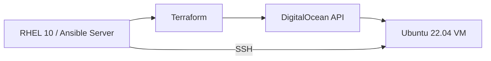
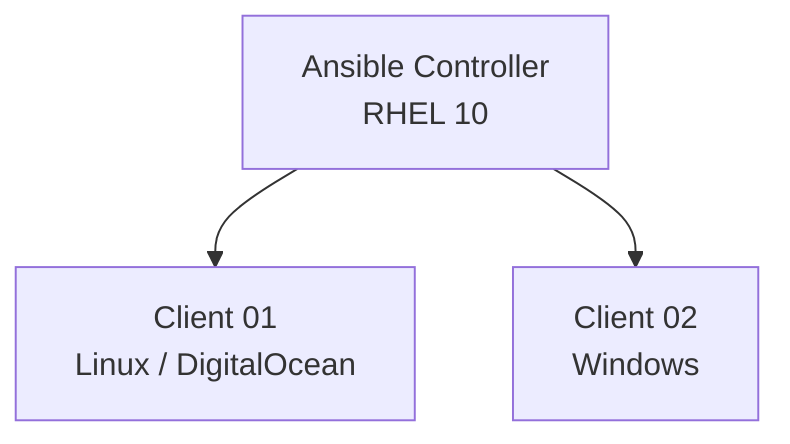

# 09 · Automatización e infraestructura como código

> Webmin · Terraform · Ansible · Ad-Hoc · Playbooks

[⬅️ Volver al índice](../README.md)

## 🎬 Playlists

- Práctica 01: `PENDIENTE`
- Práctica 02: `PENDIENTE`
- Práctica 03: `PENDIENTE`
- Práctica 04: `PENDIENTE`
- Práctica 05: `PENDIENTE`

---

# 🧪 Práctica 01 — Webmin

## Objetivo

Demostrar que determinadas tareas de administración también pueden ejecutarse mediante una interfaz web.

Documenta y demuestra:

| Área | Demostración |
|---|---|
| Usuarios | Crear y eliminar usuario |
| Servicios | Iniciar/detener/reiniciar `sshd` |
| Red | Configurar IP estática |
| Software | Instalar / eliminar una herramienta |
| Archivos | Crear / editar / eliminar |
| Monitorización | CPU / RAM / almacenamiento |

### ✅ Evidencia

Incluye una captura por cada área y explica qué operación se ejecutó.

> [!WARNING]
> Webmin es una superficie administrativa adicional. En un servidor real debe protegerse mediante controles de red, TLS y autenticación adecuados.

---

# 🧪 Práctica 02 — Terraform + DigitalOcean

## Arquitectura



## Variables del ejercicio original

| Parámetro | Valor |
|---|---|
| Image | `ubuntu-22-04-x64` |
| Name | `OS3vm` |
| Region | `nyc1` |
| Size | `s-1vcpu-1gb` |
| SSH key | Llave pública del servidor |

## Instalación

Instala Terraform siguiendo la documentación oficial de HashiCorp correspondiente a tu arquitectura.

Comprueba:

```bash
terraform version
```

## Configuración de ejemplo

`main.tf`:

```hcl
terraform {
  required_providers {
    digitalocean = {
      source  = "digitalocean/digitalocean"
      version = "~> 2.0"
    }
  }
}

provider "digitalocean" {
  token = var.do_token
}

variable "do_token" {
  type      = string
  sensitive = true
}

resource "digitalocean_droplet" "os3vm" {
  name   = "OS3vm"
  region = "nyc1"
  size   = "s-1vcpu-1gb"
  image  = "ubuntu-22-04-x64"
  ssh_keys = [var.ssh_key]
}

variable "ssh_key" {
  type      = string
}
```

> [!IMPORTANT]
> No guardes el token de DigitalOcean en Git. Usa variables de entorno, un archivo `.tfvars` ignorado o un gestor de secretos.

## Ciclo de Terraform

```bash
terraform init
terraform fmt
terraform validate
terraform plan
terraform apply
```

Valida por SSH y desde el portal del proveedor.

Cuando termines el laboratorio:

```bash
terraform destroy
```

Esto es importante para evitar recursos olvidados.

---

# 🧪 Práctica 03 — Ansible Controller

RHEL 10 incluye `ansible-core` 2.16 y permite utilizar un host RHEL como control node; los managed nodes no necesitan tener Ansible instalado. citeturn551718search1

## Arquitectura



## Usuario `ansible`

En el controller y nodos según el rol:

```bash
sudo useradd ansible
sudo passwd ansible
```

En Linux, concede sudo según la política del laboratorio. En Windows, configura una cuenta administrativa adecuada para WinRM.

## SSH para Linux

```bash
sudo -u ansible ssh-keygen -t ed25519
```

Copia la clave pública al nodo Linux y prueba:

```bash
ssh ansible@<IP_LINUX>
```

## Inventario

En `/etc/ansible/hosts`:

```ini
[linux]
linux01 ansible_host=<IP_LINUX>

[win]
windows01 ansible_host=<IP_WINDOWS>
```

Para Windows, documenta el método de conexión WinRM/PSRP y sus variables de inventario según tu versión de Ansible y Windows.

## Ping

```bash
ansible all -m ping
```

Para Windows:

```bash
ansible win -m ansible.windows.win_ping
```

---

# 🧪 Práctica 04 — Comandos Ad-Hoc

## `win_copy`

Ejemplo:

```bash
ansible win -m ansible.windows.win_copy \
  -a 'src=./archivo.txt dest=C:\\Users\\<USUARIO>\\Documents\\archivo.txt'
```

Verifica desde Windows que el archivo existe.

## Reinicio del nodo Linux

```bash
ansible linux -m ansible.builtin.reboot
```

> [!WARNING]
> El módulo `reboot` interrumpe temporalmente la conexión. Úsalo solo en el nodo de laboratorio.

---

# 🧪 Práctica 05 — Playbooks

## A. Instalar Notepad++ en Windows

Ejemplo conceptual usando `win_package`:

```yaml
---
- name: Instalar Notepad++ en Windows
  hosts: win
  gather_facts: false
  tasks:
    - name: Instalar Notepad++
      ansible.windows.win_package:
        path: 'C:\\ruta\\al\\instalador.exe'
        state: present
```

La ruta real del instalador debe existir en el nodo y seguir las políticas de tu laboratorio.

## B. Instalar NGINX en Linux

```yaml
---
- name: Instalar y arrancar NGINX
  hosts: linux
  become: true
  tasks:
    - name: Instalar nginx
      ansible.builtin.dnf:
        name: nginx
        state: present

    - name: Habilitar y arrancar nginx
      ansible.builtin.service:
        name: nginx
        state: started
        enabled: true
```

Validación:

```bash
ansible-playbook --syntax-check nginx.yml
ansible-playbook nginx.yml
```

RHEL System Roles también proporciona roles para administración consistente y repetible desde Ansible. citeturn551718search0

---

## ✅ Checklist

- [ ] Webmin funcional.
- [ ] Terraform instalado.
- [ ] Droplet creada.
- [ ] SSH validado.
- [ ] `terraform destroy` ejecutado al terminar.
- [ ] Controller Ansible listo.
- [ ] Cliente Linux gestionable.
- [ ] Cliente Windows gestionable.
- [ ] `ping` exitoso.
- [ ] `win_copy` ejecutado.
- [ ] Reinicio con `reboot` validado.
- [ ] Playbook Windows.
- [ ] Playbook Linux.
