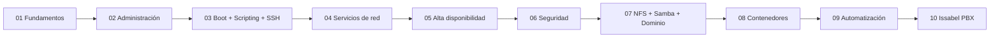
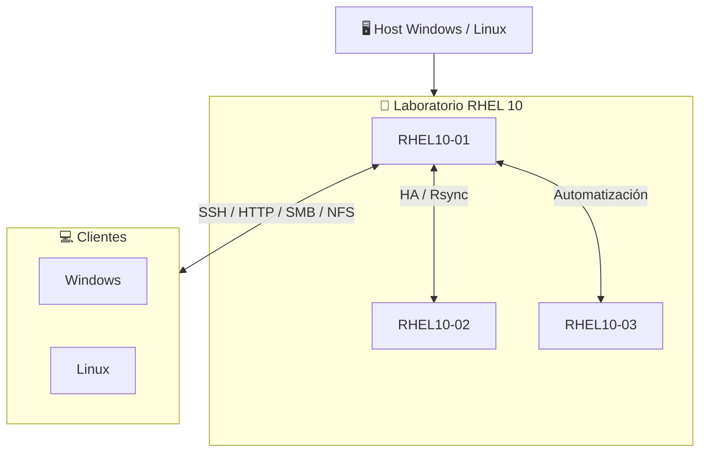

<div align="center">

# RED HAT ENTERPRISE LINUX 10

### Laboratorio de Administración Linux • Guía práctica • Evidencias • Automatización

<p>
  
  
  
  
</p>

**De la instalación de RHEL a alta disponibilidad, seguridad, almacenamiento, servicios, contenedores y automatización.**

> 👨‍💻 **Autor:** **Victor de Peña**  
> 🎓 **Estudiante de Seguridad Informática — ITLA**

[🧭 Mapa de laboratorios](#-mapa-de-laboratorios) • [📚 Módulos](#-módulos) • [🎥 Playlists](#-playlists) • [🧪 Evidencias](#-cómo-usar-cada-laboratorio) • [📖 Referencias](#-documentación-base)

</div>

---

##  ¿Qué es este repositorio?

Este repositorio convierte una colección de prácticas de administración Linux en un **laboratorio documentado y reproducible sobre Red Hat Enterprise Linux 10**.

La idea no es guardar únicamente comandos: cada práctica se presenta como una mini-guía de infraestructura con:

- 🎯 **Objetivo** y conceptos que se están entrenando.
- 🧰 **Prerequisitos** y topología necesaria.
- 🧱 **Implementación paso a paso**.
- 🔎 **Verificación** de que realmente funciona.
- 🧯 **Troubleshooting** para los errores más comunes.
- 🎥 **Playlist / video por práctica** mediante un enlace preparado para completar.
- 📸 **Evidencias sugeridas** para demostrar el resultado.
- 📝 **Notas de compatibilidad RHEL 10** cuando el enunciado original utiliza herramientas de otras distribuciones o versiones.

> [!IMPORTANT]
> Algunos laboratorios proceden de un enunciado académico creado para versiones y distribuciones anteriores. En este repositorio se conserva el objetivo original, pero se documentan las diferencias relevantes de RHEL 10 en una sección **RHEL 10 / Modernización** de cada práctica.

---

## 🧭 Mapa de laboratorios



### 🗺️ El recorrido

| # | Módulo | Tema central | Resultado |
|---:|---|---|---|
| 01 | Fundamentos | Instalación, red, usuarios, permisos | 🟢 Base del sistema |
| 02 | Administración | DNF, tareas programadas, almacenamiento | 🟢 Operación del host |
| 03 | Boot / Scripting / SSH | GRUB, scripts, acceso remoto | 🟢 Administración remota |
| 04 | Servicios | HTTP, correo, impresión | 🟡 Servicios de infraestructura |
| 05 | HA | Rsync, Pacemaker/Corosync, Keepalived | 🟠 Resiliencia |
| 06 | Seguridad | GPG, firewall, IDS, 2FA | 🔴 Defensa del host |
| 07 | Compartición / Dominio | NFS, Samba, Samba AD | 🟠 Integración |
| 08 | Contenedores | Docker solicitado → ruta RHEL 10 con Podman | 🟣 Cloud-native |
| 09 | Automatización | Webmin, Terraform, Ansible | 🔵 IaC + Automation |
| 10 | PBX | Issabel sobre Rocky Linux 8 | 🟤 Proyecto legado / integración |

---


## 🎥 Playlists

Cada práctica tiene un bloque preparado para su playlist o video de YouTube. Los enlaces están como **placeholders** para no inventar URLs que todavía no fueron proporcionadas.

| Módulo | Práctica | YouTube |
|---|---|---|
| 01 | P1–P4 | https://www.youtube.com/playlist?list=PLQ9VDfI34EckrjTbpl6UQh6QGQlRjJ9MQ |
| 02 | P1–P3 | https://www.youtube.com/playlist?list=PLQ9VDfI34EckTTf6qa4jeIUFh4jxn7If- |
| 03 | P1–P3 | https://www.youtube.com/playlist?list=PLcPUTSzk0sXI |
| 04 | P1–P3 | https://www.youtube.com/playlist?list=PLQ9VDfI34EclPKPJziFwlAyN4DjNBG0Uj |
| 05 | P1–P3 | https://www.youtube.com/playlist?list=PLFrQuLFGh3i0 |
| 06 | P1–P4 | https://www.youtube.com/playlist?list=PLBJrGewVrphc |
| 07 | P1–P3 | https://www.youtube.com/playlist?list=PLHdw_3GmkLLA |
| 08 | P1–P3 | https://www.youtube.com/playlist?list=PLN6TVtpUmTrY |
| 09 | P1–P5 | https://www.youtube.com/playlist?list=PLYKTLDoHjKa0 |
| 10 | P1 | `PENDIENTE` |

---

## 🧪 Cómo usar cada laboratorio

Todos siguen una misma estructura para que el repositorio se sienta como un **manual de operaciones** y no como una colección de apuntes:

```text
Objetivo
   ↓
Arquitectura / prerequisitos
   ↓
Implementación
   ↓
Verificación
   ↓
Evidencia
   ↓
Troubleshooting
   ↓
Checklist de finalización
```

### Convención de comandos

```bash
# Comandos ejecutados como root
[root@rhel10 ~]# comando

# Comandos ejecutados como usuario normal
[user@rhel10 ~]$ comando
```

Cuando sea necesario reemplazar valores, se usan marcadores como:

```text
<IP_SERVIDOR>
<INTERFAZ>
<USUARIO>
<DOMINIO>
```

---

## 🧱 Arquitectura de referencia



> [!TIP]
> Para prácticas con varios nodos, documenta siempre **nombre del nodo, IP, rol, hostname y red**. Eso hace que otra persona pueda reconstruir tu laboratorio sin adivinar nada.

---

## 🧩 Estructura del repositorio

```text
Red-Hat-Enterprise-Linux-10/
├── README.md
├── 01-fundamentos/
│   └── README.md
├── 02-administracion-del-sistema/
│   └── README.md
├── 03-boot-scripting-ssh/
│   └── README.md
├── 04-servicios-de-red/
│   └── README.md
├── 05-alta-disponibilidad/
│   └── README.md
├── 06-seguridad/
│   └── README.md
├── 07-comparticion-y-dominio/
│   └── README.md
├── 08-contenedores/
│   └── README.md
├── 09-automatizacion/
│   └── README.md
├── 10-issabel-pbx/
│   └── README.md
├── docs/
│   ├── topologia.md
│   └── evidencia.md
├── assets/
└── scripts/
```

---

## 🧠 Filosofía del repositorio

### 01 — No documentamos solo el “cómo”

Cada procedimiento intenta responder también **qué hace el comando, por qué existe y cómo verificamos que funcionó**.

### 02 — La evidencia es parte del laboratorio

Una configuración sin validación no está terminada. Por eso cada práctica incluye comandos de comprobación y una lista de evidencias sugeridas.

### 03 — RHEL 10 primero

Cuando el enunciado académico utiliza una herramienta que no representa la ruta nativa de RHEL 10, el README conserva el objetivo original y explica la ruta compatible con RHEL 10.

Ejemplos importantes:

- NetworkManager ofrece `nmcli`, `nmtui`, GUI, `nmstatectl` y roles de RHEL para configurar red. citeturn551718search5
- RHEL 10 usa `httpd` para Apache. citeturn447372search5
- El filtrado de red en RHEL 10 se documenta principalmente con `firewalld` y `nftables`. citeturn447372search2
- Docker Engine no está soportado en RHEL 10; Podman es la ruta nativa y `podman-docker` ofrece compatibilidad de CLI. citeturn447372search1
- El Add-On de alta disponibilidad de RHEL usa Pacemaker como gestor de recursos y Corosync para membresía/comunicación; `pcs` es la herramienta CLI principal. citeturn447372search0turn447372search4
- RHEL 10 soporta ext4 y documenta `mount`/`findmnt`/`fstab` para el ciclo de montaje. citeturn551718search7turn551718search8

---

## 📖 Documentación base

La base técnica de la modernización de estas prácticas es la documentación oficial de Red Hat Enterprise Linux 10:

- [Networking](https://docs.redhat.com/en/documentation/red_hat_enterprise_linux/10/html/configuring_and_managing_networking/)
- [File systems](https://docs.redhat.com/en/documentation/red_hat_enterprise_linux/10/html/managing_file_systems/)
- [Firewalls](https://docs.redhat.com/en/documentation/red_hat_enterprise_linux/10/html/configuring_firewalls_and_packet_filters/)
- [Web servers](https://docs.redhat.com/en/documentation/red_hat_enterprise_linux/10/html/deploying_web_servers_and_reverse_proxies/)
- [High Availability](https://docs.redhat.com/en/documentation/red_hat_enterprise_linux/10/html/configuring_and_managing_high_availability_clusters/)
- [Containers](https://docs.redhat.com/en/documentation/red_hat_enterprise_linux/10/html/building_running_and_managing_containers/)
- [RHEL System Roles / Ansible](https://docs.redhat.com/en/documentation/red_hat_enterprise_linux/10/html/automating_system_administration_by_using_rhel_system_roles/)

---

<div align="center">

**Red Hat Enterprise Linux 10 · Laboratorios documentados como infraestructura real**

</div>
